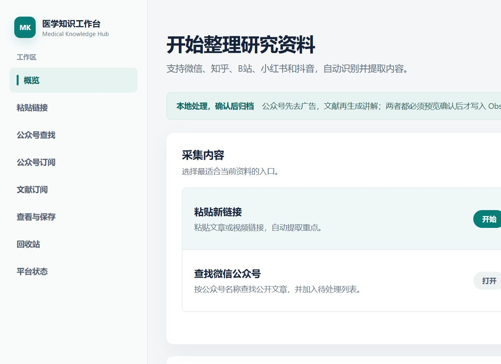

# Medical Knowledge Hub

本地采集医学内容，去重和整理后交给你确认，再归档到 Zotero 与 Obsidian。



## 能做什么

| 入口 | 自动处理 | 最终去向 | Codex Token |
| --- | --- | --- | --- |
| 微信公众号 | 在已登录微信中按名称和日期找文章，复制公开链接，去广告并保留正文图片 | Obsidian `微信公众号/` | 不消耗 |
| 医学文献 | RSS/Atom、Europe PMC 等发现文献，去重并保存题录/可用 PDF | Zotero → Skill 讲解 → Obsidian `证据卡/` | 仅 Skill 讲解消耗 |
| 公开链接 | 识别微信、知乎、B站、小红书、抖音链接并加入待处理区 | 预览确认后写入 Obsidian | 公众号不消耗；文献讲解消耗 |

所有写入都经过“查看与保存”页面。未确认的内容不会进入 Obsidian。

## 三步启动

### 1. 准备软件

- Windows 10/11、Python 3.11+、Node.js 20+、Git 与 GitHub CLI
- Obsidian 和一个已创建的 Vault
- Zotero 9 与官方 Zotero Connector（使用文献订阅时）
- 已登录的 Codex CLI（使用文献讲解时）
- 已登录的微信电脑版 4.x（按公众号名称查找文章时）
- OpenCLI 1.8.6 与 Browser Bridge（读取知乎、B站、小红书、抖音时）

### 2. 安装

```powershell
gh repo clone zoutingjian37-create/medical-knowledge-hub D:\Codex\medical-knowledge-hub
Set-Location D:\Codex\medical-knowledge-hub
powershell.exe -NoProfile -ExecutionPolicy Bypass -File .\install.ps1 -CreateDesktopShortcut
```

安装器把环境、缓存和运行状态放在 `D:\Codex`，并安装项目附带的两个 Skill。

### 3. 连接 Obsidian 并启动

在项目根目录创建 `.env`：

```dotenv
OBSIDIAN_VAULT_PATH=D:\你的Obsidian目录
```

双击桌面 `Medical Knowledge Hub`，或运行 `start.bat`。工作台地址是 <http://127.0.0.1:5000/admin.html>。

新克隆仓库的订阅列表为空，不附带作者的公众号、期刊、研究方向或 Vault 路径。

## 使用方式

### 公众号

1. 提前登录微信电脑版。
2. 在“公众号订阅”中每行填写一个完整公众号名称并保存，或在“公众号查找”中临时输入名称和任意日期范围。
3. 程序进入公众号“文章”栏，按北京时间定位日期；距离较远时粗定位，接近目标后逐组确认。
4. 成功链接会立即写入检查点，随后统一解析、去广告、去重并生成图文预览。
5. 在“查看与保存”中勾选、全选、批量预览并一次归档。

订阅框保存后的名单是下次“立即查找”和每日任务的唯一名单来源。新增、删除或改名会在下一次任务生效；未保存编辑不生效；历史文章不会因删除订阅而删除。

公众号清洗是通用的内容语义规则，不包含任何公众号名称特例：课程招生、学员喜报、咨询、社群和二维码等明确推广会被删除；统计方法、研究设计、结论和无法确认是广告的正文图片会保留。旧预览可在待确认页勾选后点击“重新清洗公众号”。

### 文献订阅

1. 启动 Zotero，在左侧选中用于接收文献的目录。
2. 在“文献订阅”中添加期刊主页、RSS/Atom、ISSN、Europe PMC 查询或自然语言筛选要求。
3. 软件先用代码筛选和去重，再保存题录与可用 PDF；只有入选文献调用 `distill-medical-literature`。
4. 预览中会区分全文证据与摘要级证据，确认后才写入 Obsidian。

若全文需要学校权限，运行记录会显示“等待学校登录”并打开出版社页面。你亲自登录并点击 Zotero Connector；软件不读取或保存学校账号、密码、Cookie 或 Token。回到工作台点击“已用 Zotero Connector 保存 PDF，继续”即可恢复任务。

每日自动运行可总开关，也可单独暂停订阅；默认 08:30、每天最多提炼 5 篇、错过后在电脑下次可用时补跑。关闭自动运行不影响手动“立即运行”。

### 单条公开链接

在“粘贴链接”中粘贴公开地址并点击“提取并生成预览”。重复链接不会创建第二份任务；纯推广公众号文章不会进入待确认区。

## 本地数据与安全边界

- 个人订阅、运行断点和去重索引保存在 `D:\Codex\state\medical-knowledge-hub`，不进入 Git。
- 临时正文保存在项目外缓存；归档后删除。公众号图片保留远程 HTTP(S) 地址，不复制原文到仓库。
- PDF 留在 Zotero；Obsidian 只保存提炼结果、标识符和来源地址。
- 微信发现只操作已登录桌面界面并复制公开 `mp.weixin.qq.com` 链接，不读取聊天记录、Cookie、Token 或账号密码。
- 本地 API 默认只绑定 `127.0.0.1`；来源 HTML 和脚本不会在预览中执行。
- 删除先进入回收站，默认 7 天后彻底清理，可设置 1–30 天；永久删除不会删除 Zotero 文献或已归档的 Obsidian 笔记。

## 测试

```powershell
D:\Codex\venvs\medical-knowledge-hub\Scripts\python.exe -m unittest discover -s tests -v
node --test tests\static_assets.test.js
```

## 验收清单

- `GET /api/health` 返回 `200`。
- 公众号任意日期范围与订阅“立即查找”复用同一采集引擎。
- 纯推广文章被过滤，方法文章正文与非广告图片仍可预览。
- 重复运行不生成重复任务或重复 Obsidian 笔记。
- 文献可进入 Zotero；权限文献会停在“等待学校登录”。
- 未确认预览不会改动 Obsidian。
- 发布包不含 `.env`、个人订阅、Vault 路径、Cookie、Token、缓存或诊断文件。

## 故障排查

- 页面打不开：检查 <http://127.0.0.1:5000/api/health>，再查看 `D:\Codex\state\medical-knowledge-hub\logs`。
- 微信查找失败：确认微信已登录且窗口可见，运行期间不要操作微信；失败弹窗会显示具体步骤和恢复位置。
- 其他平台读取失败：执行 `install-platform-engines.ps1`，检查 OpenCLI 与 Browser Bridge。
- Zotero 未连接：启动 Zotero 9，开启本机应用通信，并确认 Connector 能手动保存一篇文献。
- Codex 无法讲解文献：确认 Codex CLI 已登录且 `distill-medical-literature` 已安装。
- Obsidian 无法写入：检查 `OBSIDIAN_VAULT_PATH`，修改 `.env` 后重启服务。

详细复现、接口和排障文档：

- [Codex 复现指南](docs/CODEX_REPRODUCTION.md)
- [平台适配器与边界](docs/platform-adapters.md)
- [文献全文解析与学校登录](docs/literature-download-resolver.md)
- [第三方兼容策略](docs/upstream-compatibility.md)
- [第三方组件与许可证](THIRD_PARTY_NOTICES.md)

## 开源说明

本项目由 [zoutingjian37-create](https://github.com/zoutingjian37-create) 维护。OpenCLI、Zotero、微信桌面端及其他外部组件通过公开接口或独立运行时协作，其源代码不合并进本仓库。

许可证：[GNU AGPL v3](LICENSE)。
