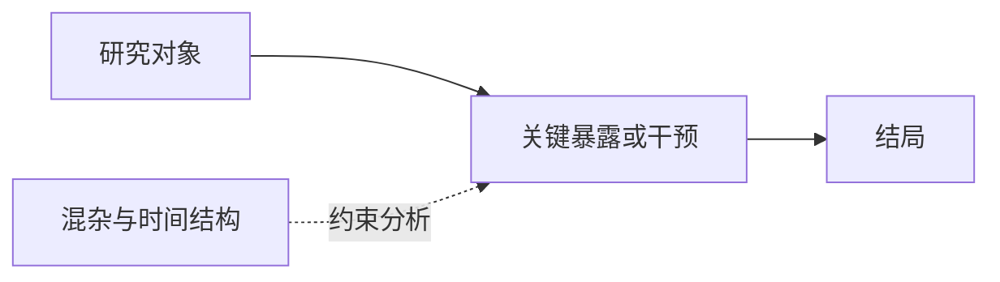

# 输出契约

输出一份 Markdown 预览。Frontmatter 使用以下字段：

```yaml
---
source_url: "https://公开来源地址"
source_platform: wechat | journal | pubmed | europe_pmc | website | other
source_account: "作者、公众号或期刊"
source_title: "来源标题"
published_at: "YYYY-MM-DD 或未识别"
evidence_level: public_account_summary | abstract_verified | full_text_verified
status: preview
wiki_updates: []
---
```

正文严格使用以下标题。它们是讲解的叙事顺序，不是机械资料卡；每节必须回答标题提出的问题。

```markdown
# 一句话结论式标题

## 为什么值得看
用 1–2 句提出研究或临床决策困境；不能用夸张标题代替问题。

## 研究问题
交代人群、比较、结局与时间顺序。PICO/PECO 是底稿，不堆成术语表。

## 研究怎么做
说明数据来源、研究设计、样本和真正影响解释的变量。

## 统计方法为什么这样选
先说普通做法遗漏了什么，再说该方法如何补上；写出前提和一个常见误用。



## 主要发现
写方向、适用人群和会改变判断的数字；不要复述结果表。

## 这篇研究的新意
先从文章判断新意属于问题、暴露因素/指标、数据、设计、统计方法、机制、检测流程、应用或验证中的哪一类。用户当前优先关注统计方法创新和暴露因素/指标创新，但文章不支持时不得硬凑；复杂不等于创新。

## 对科研设计的启发
写可迁移的研究结构、数据条件和下一步核查事项；候选选题只能标为待核查。

## 局限与证据边界
只有存在明显误读风险时才用 1–3 句提醒，正文其他章节不要重复同一限制。成文时可把本标题改成自然问题，例如“这项结果应该怎么看？”。

## 原论文图与方法图
全文可核验且图像许可允许复用时，选择 1–3 张关键结果图实际嵌入正文。每张图都要按“图前提出读图问题 → 图片与图号 → 图后解释它回答了什么”组织，并标注论文来源与许可。受限许可或只有摘要时只写图号、图意和公开来源链接。必须保留上方 Mermaid 方法图，或在不适用时说明原因。

## 来源

状态：等待用户确认
```

规则：

- `source_url` 必须是永久公开来源，不能是临时缓存路径。
- 只有对照摘要或全文后，才能使用 `abstract_verified` 或 `full_text_verified`。
- “主要发现”以定性结果为主，只保留会改变判断的数字。
- “这篇研究的新意”由文章内容决定类型；涉及统计方法时，再区分“方法学原创”“方法应用创新”或“高级方法使用”。
- 没有统计方法创新时可以直接说明文章的新意实际落在哪一类，不要硬造统计创新。
- “对科研设计的启发”中的选题只能标记为“灵感候选”或“待核查”，不得声称可直接立项。
- `wiki_updates` 只列相对 Vault 根目录的 Markdown 路径；默认只生成建议。
- 不保存原文，不把广告、课程、二维码或咨询信息写入任何章节。
- 不能凭空画结果图、机制图或流程图；Mermaid 只能表达材料明确支持的研究设计与分析关系。
- 成文后执行“语言自检”：开场在 3 句内进入问题；每节最多 1–2 个有效设问；每段只完成一个认知动作；类比必须回到正式术语和边界。
- 开放许可全文优先嵌入直接支撑主要发现的结果图，不得用 Mermaid 流程图代替已有的关键结果图。
- 图前说明读者要看什么，图后说明它支持什么；只有容易误读时才补一句不能支持什么。删除装饰图、录用图、二维码和无信息截图。
- 不复制来源的固定句式、连续表达或品牌口吻；语言动作仅用于组织证据。
- 准确性提醒集中出现一次即可；禁止为了显得严谨反复使用“边界、并非、尚未、不能据此”等审稿式句型。
- 最后一行必须是 `状态：等待用户确认`。
